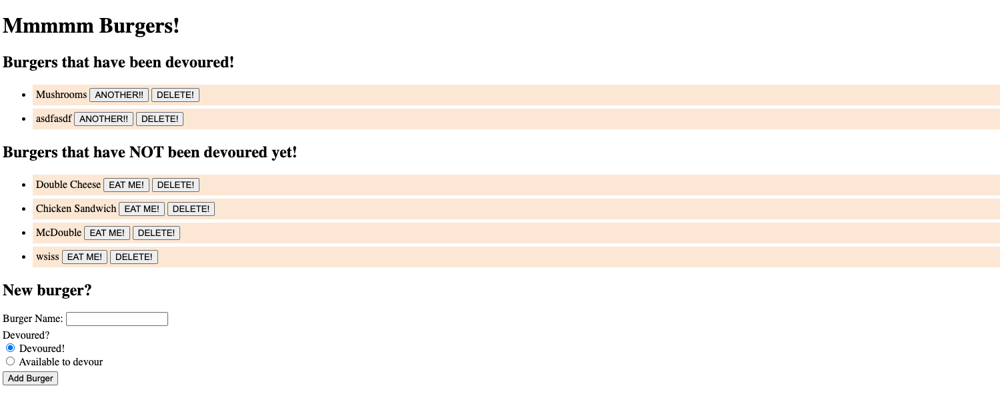

# Burger App

## Description

An application that lets display conceptual burgers which you can in turn devour.

## Table of Contents

- Installation
- Usage
- License
- Contributors
- Tests
- Questions

## Installation

https://burger-app-ak.herokuapp.com/ - current build is not deployed, best way to use it is on local host through the repository here: https://github.com/icecicle04/burger

## Usage

Input the new burger item you would like to devour. Click add burger. Once the burger is added to the list, you can then devour the burger and it will move to the devoured column.

## Licenses

MIT License

## Contributors

Ali Khan

## Tests

Tested on Local Host

## Questions

email Ali.Khan4990@gmail.com

## Images

